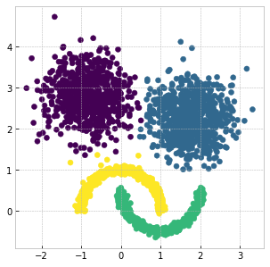
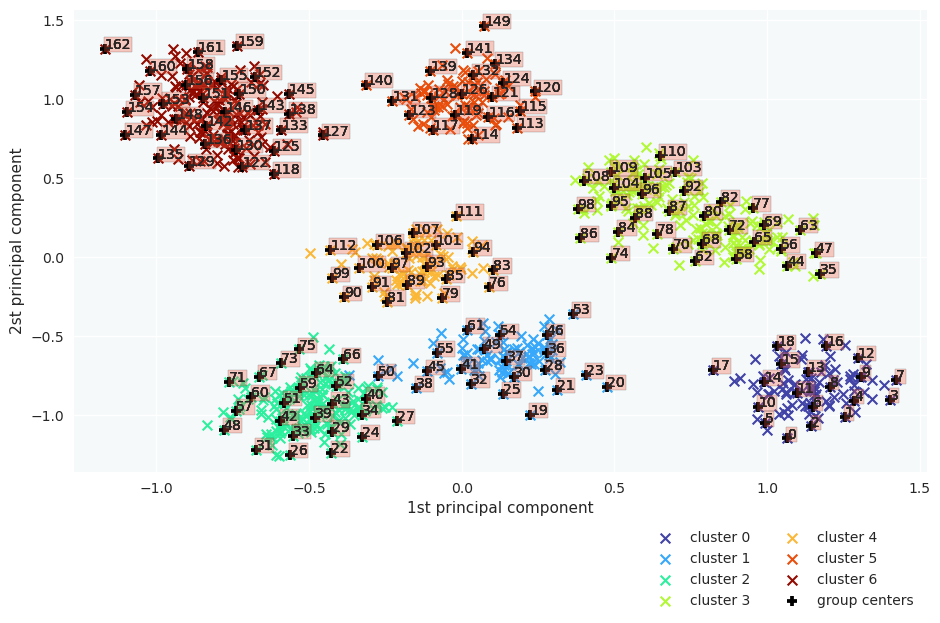
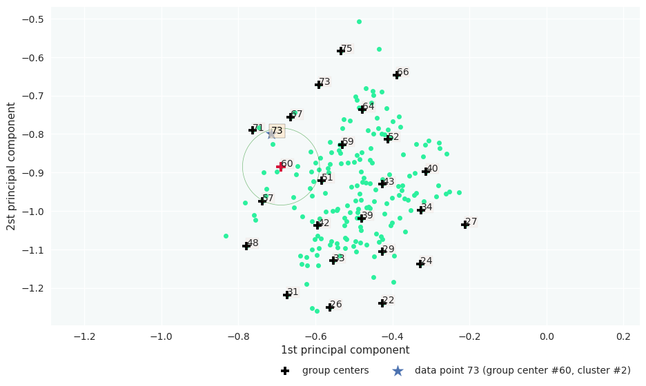
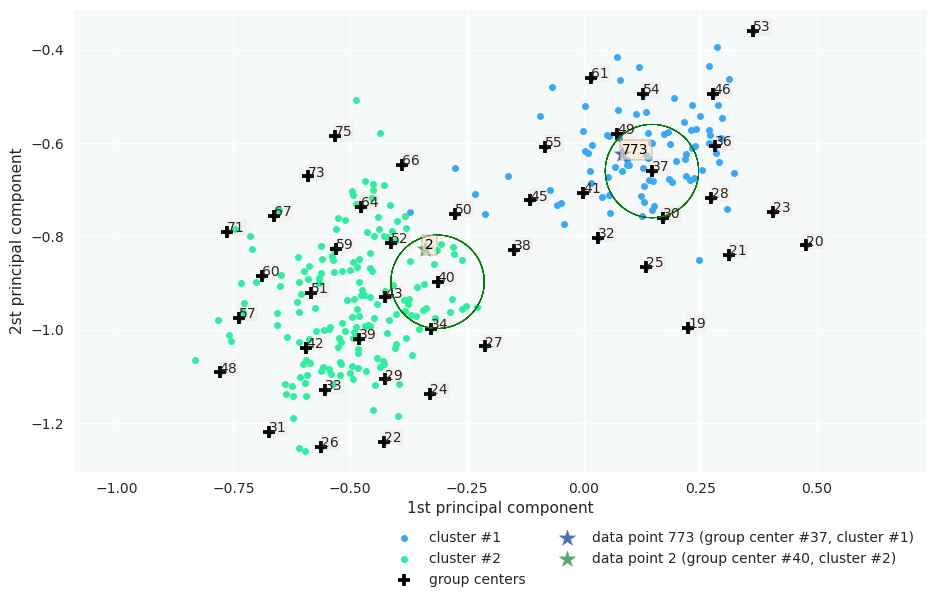
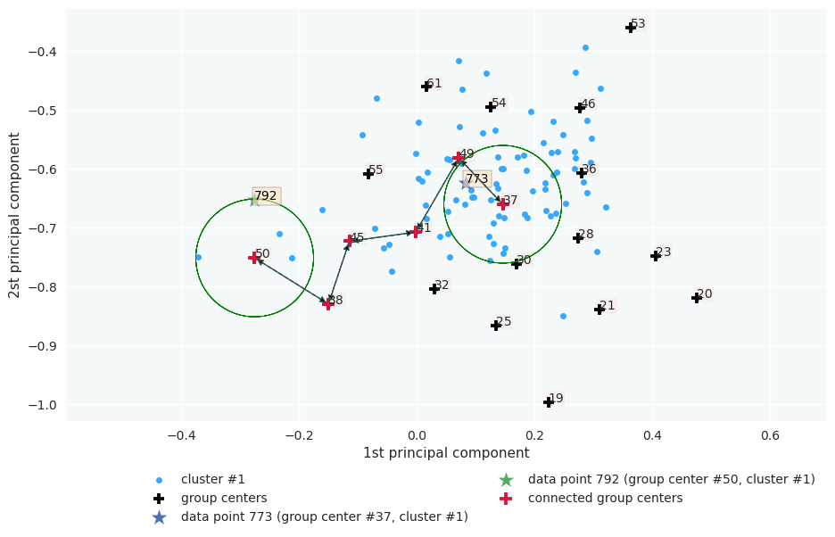
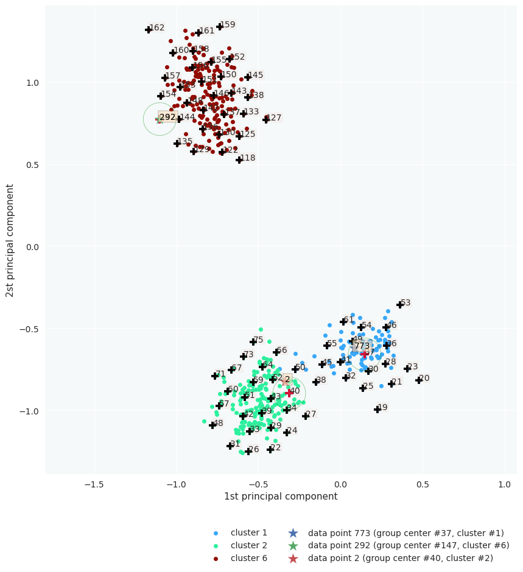
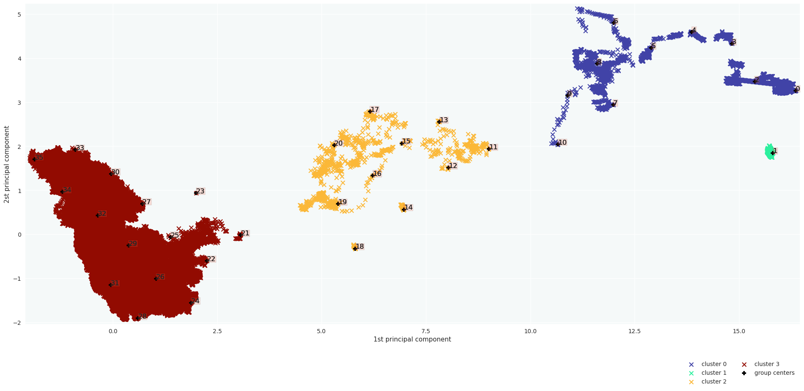
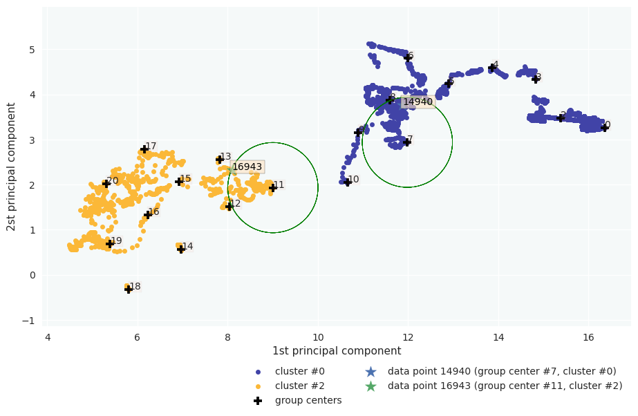
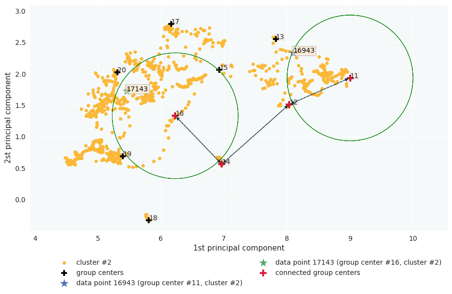

Clustering Tutorial
======================================

The CLASSIX with density method implements density clustering in an explicit way while the one with distance method implements density clustering in an implicit way. We will illustrate how to use them separately.  

The examples here are demonstrated with a sample with a more complicated shape:

.. code:: python

    import matplotlib.pyplot as plt
    from sklearn import datasets
    import numpy as np
    random_state = 1
    moons, _ = datasets.make_moons(n_samples=1000, noise=0.05, random_state=random_state)
    blobs, _ = datasets.make_blobs(n_samples=1500, centers=[(-0.85,2.75), (1.75,2.25)], cluster_std=0.5, random_state=random_state)
    X = np.vstack([blobs, moons])

.. admonition:: Note

    Setting radius lower, the more groups will form, and the groups tend to be separated instead of merging as clusters, and therefore runtime will increase. 
    
++++++++++++++++++
Density clustering
++++++++++++++++++

Instead of leaving the default option as the previous example, in this example, we can explicitly set a parameter ``group_merging`` to specify which merging strategy we would like to adopt. 
Also, we employ ``sorting='pca'`` or other choices such as 'norm-orthant' or 'norm-mean'. In most cases, we recommend PCA sorting. Other available parameters include ``radius`` and ``minPts``. The parameter of ``radius`` is a tolerance value dominating the aggregation phase, which immediately affects the merging phase. 
Usually, the thinner boundary between the clusters are, the lower ``radius`` is required. In addition, we would explain why we set `minPts` to 10 later. Also, we can output the log by setting verbose to 1, then it clearly shows how many clusters and the associated size we get:

.. code:: python

    from classix import CLASSIX
    clx = CLASSIX(sorting='pca', group_merging='density', radius=0.1, minPts=10)
    clx.fit(X)

The output of the code is:

.. parsed-literal::

    CLASSIX(sorting='pca', radius=0.1, minPts=10, group_merging='density')
    The 2500 data points were aggregated into 316 groups.
    In total 16395 comparisons were required (6.56 comparisons per data point). 
    The 316 groups were merged into 47 clusters with the following sizes: 
        * cluster 0 : 717
        * cluster 1 : 711
        * cluster 2 : 500
        * cluster 3 : 500
        * cluster 4 : 10
        ......
        * cluster 45 : 1
        * cluster 46 : 1
    As MinPts is 10, the number of clusters has been further reduced to 5.
    Try the .explain() method to explain the clustering.

The reason why we set ``minPts`` to 10 is that we want the clusters with a size smaller than 10 to agglomerate to other big clusters which are partitioned significantly.

``minPts`` is a parameter which we denote it as outliers threshold, and we will illustrate it in the section of ``Outlier Detection``.

The visualization of clustering results is reasonable:

.. code:: python

    plt.figure(figsize=(5,5))
    plt.scatter(X[:,0], X[:,1], c=clx.labels_)
    plt.show()

++++++++++++++++++
Distance clustering
++++++++++++++++++

The distance-based CLASSIX has the same steps as density-based CLASSIX except that the density comparison steps, in such a way distance-based CLASSIX does not require calculating the density, hence intuitively would be faster. By contrast, it just compares the pair of the clusters one at a time to determine if they should merge. 
Also, we propose a distance-based clustering exempted from calculating the density but with one more parameter for appropriate smoothing ``scale``. By tuning the ``scale``, we only calculate the distance between pairs of starting points and define the distance as the weights in the graph, and the distance that is smaller than $\texttt{scale}*\radius$ is assigned to 1 otherwise 0. The next step, similarly, is to find the connected components in the graph as clusters.

Similar to the previous example, we refer ``group_merge`` to 'distance', then adopt distance-based CLASSIX, the code is as below:

.. code:: python

    clx= CLASSIX(sorting='pca', group_merging='distance', radius=0.1, minPts=4)
    clx.fit(X)

.. parsed-literal::

    A clustering of 1000 data points with 2 features has been performed. 
    The radius parameter was set to 0.10 and MinPts was set to 99. 
    As the provided data has been scaled by a factor of 1/8.12,
    data points within a radius of R=0.10*8.12=0.81 were aggregated into groups. 
    In total 4610 comparisons were required (4.61 comparisons per data point). 
    This resulted in 163 groups, each uniquely associated with a starting point. 
    These 163 groups were subsequently merged into 7 clusters. 

    In order to explain the clustering of individual data points, 
    use .explain(ind1) or .explain(ind1, ind2) with indices of the data points.

Visualize the result:

.. code:: python

    plt.figure(figsize=(5,5))
    plt.scatter(X[:,0], X[:,1], c=clx.labels_)
    plt.show()

.. image:: images/demo3.png
    :width: 430

.. admonition:: Note

    The density-based merging criterion usually results in slightly better clusters than the distance-based criterion, but the latter has a significant speed advantage.

Visualize connecting edge
------------------------------

Now we use the same example to demonstrate how cluster are formed by computing starting points and edge connections. We can output the information by

.. code:: python

    clx.visualize_linkage(scale=1.5, figsize=(8,8), labelsize=24, fmt='png')

.. image:: images/linkage_scale_1.5_tol_0.1.png

.. admonition:: Note

    The starting points can be interpreted as a reduced-density estimator of the data. 

There is one more parameter that affects distance-based CLASSIX, that is ``scale``.  By simply adding the parameter ``plot_boundary`` and setting it to ``True``, then we can obtain the starting points with their group boundary. The visualization of the connecting edge between starting points with varying ``scale`` is plotted as below:

.. code:: python

    for scale in np.arange(1.1, 2, 0.1):
        clx = CLASSIX(sorting='pca', radius=0.1, group_merging='distance', verbose=0)
        clx.fit_transform(X)
        clx.visualize_linkage(scale=round(scale,1), figsize=(8,8), labelsize=24, plot_boundary=True, fmt='png')

.. image:: images/single_linkage.png

Considering a graph constructed by the starting points, as ``scale`` increases, the number of edges increases, therefore, the connected components area enlarges while the number of connected components decreases.
Though in most cases, the scale setting is not necessary, when the small ``radius`` needed, adopting distance-based CLASSIX with an appropriate ``scale`` can greatly speed up the clustering application, such as image segmentation.

+++++++++++++++++++++++
Explainable Clustering
+++++++++++++++++++++++

CLASSIX provides an appealing explanation for clustering results, either in a global view or by specific indexing. CLASSIX provides a very flexible and customized interface for clustering explain method, while the default setting is enough for most researchers and engineers. For more details, please read the API reference of `classix.CLASSIX.explain <https://classix.readthedocs.io/en/latest/_autosummary/classix.CLASSIX.explain.html#classix.CLASSIX.explain>`_. In the following section, we will illustrate CLASSIX ``explain`` method in a straightforward manner.

If we would like to make plot accompany just remember to set ``plot`` to ``True``.

We now have a global view of it:

.. code:: python

    from sklearn import datasets
    from classix import CLASSIX
    
    X, y = datasets.make_blobs(n_samples=1000, centers=10, n_features=2, cluster_std=1, random_state=42)
    
    clx = CLASSIX(sorting='pca', group_merging='distance', radius=0.1, verbose=1, minPts=99)
    clx.fit(X)

    clx.explain(plot=True, savefig=True, figsize=(10,10))

The output is:

.. parsed-literal::

    CLASSIX(sorting='pca', radius=0.1, minPts=99, group_merging='distance')
    The 1000 data points were aggregated into 163 groups.
    In total 4610 comparisons were required (4.61 comparisons per data point). 
    The 163 groups were merged into 14 clusters with the following sizes: 
          * cluster 0 : 199
          * cluster 1 : 198
          * cluster 2 : 194
          * cluster 3 : 102
          * cluster 4 : 100
                ......
          * cluster 13 : 1
    As MinPts is 99, the number of clusters has been further reduced to 7.
    Try the .explain() method to explain the clustering.

.. parsed-literal::
        CLASSIX clustered 1000 data points with 2 features. The radius parameter was set to 0.10 and minPts was set to 99. As the provided data was auto-scaled by a factor of 1/8.12, points within a radius R=0.10*8.12=0.81 were grouped together.In total, 4610 distances were computed (4.6 per data point). This resulted in 163 groups, each with a unique group center. These 163 groups were subsequently merged into 7 clusters. 
    
    In order to explain the clustering of individual data points, use .explain(ind1) or .explain(ind1, ind2) with data indices.

Track single object
------------------------------

Following the previous steps, we can analyze the specific data by referring to the index, for example here, we want to track the data with index 0:

.. code:: python

    clx.explain(73, plot=True)

Output:

.. parsed-literal::

    image successfully save as img/None73.png

Track multiple objects
------------------------------
We give two examples to compare the data pair cluster assignment as follows.

Example to show two objects in different clusters:

.. code:: python
    
    clx.explain(773,2,  plot=True)

.. parsed-literal::

    The data point 773 is in group 37, which has been merged into cluster 1.
    The data point 2 is in group 40, which has been merged into cluster 2.
    There is no path of overlapping groups between these clusters.

Example to show two objects in the same clusters:

.. code:: python
    
    clx.explain(773, 792,  plot=True, savefig=True, fmt='png', figname='ex2')

.. parsed-literal::
    
    The data point 773 is in group 37 and the data point 792 is in group 50, both of which were merged into cluster #1. 
    
    The two groups are connected via groups 37 <-> 49 <-> 41 <-> 45 <-> 38 <-> 50.
    
      Index  Group
       773     37
       882     37
       726     49
       438     41
       772     45
       117     38
       207     50
       792     50 

If you want to show the paths connected the two points, setting the optional parameter ``add_arrow`` to ``True``.
Here we also add ``figsize`` to resize the figure. More controlled parameters for fancy arrow plot can be referred to detailed documentation of `classix.CLASSIX.explain <https://classix.readthedocs.io/en/latest/_autosummary/classix.CLASSIX.explain.html#classix.CLASSIX.explain>`_. 

Additionally, if one want to index more than 2 objects, use numbrt parameters ``index{number}``, for example, indexing 3 objects information, use:

.. code:: python
    
    clx.explain(index1=773, index2=292, index3=2, figsize=(10, 10))

.. admonition:: Note

    You can simply use ``clx.getPath(ind1,ind2)`` to track the path between data point ind1 and data point ind2. 

++++++++++++++++++++++++++++
Case study of industry data
++++++++++++++++++++++++++++

Here, we turn our attention on practical data. 
Similar to above, we load the necessary data to produce the analytical result.

.. code:: python

    import time
    import numpy as np
    import classix

To load the industry data provided by Kamil, we can simply use the API ``load_data`` and require the parameter as ``vdu_signals``
we leave the default parameters except setting radius to 1.

.. code:: python

    data = classix.loadData('vdu_signals')
    clx = classix.CLASSIX(radius=1, group_merging='distance')

.. admonition:: Note

    The method ``loadData`` also supports other typical UCI datasets for clustering, which include ``'vdu_signals'``, ``'Iris'``, ``'Dermatology'``, ``'Ecoli'``, ``'Glass'``, ``'Banknote'``, ``'Seeds'``, ``'Phoneme'``, ``'Wine'``, ``'CovidENV'`` and ``'Covid3MC'``. The datasets ``'CovidENV'`` and ``'Covid3MC'`` are in dataframe format while others are array format.

Then, we employ classix model to train the data and record the timing:

.. code:: python

    st = time.time()
    clx.fit_transform(data)
    et = time.time()
    print("consume time:", et - st)

.. parsed-literal::

    CLASSIX(sorting='pca', radius=1, minPts=0, group_merging='distance')
    The 2028780 data points were aggregated into 36 groups.
    In total 3920623 comparisons were required (1.93 comparisons per data point). 
    The 36 groups were merged into 4 clusters with the following sizes: 
        * cluster 0 : 2008943
        * cluster 1 : 16920
        * cluster 2 : 1800
        * cluster 3 : 1117
    Try the .explain() method to explain the clustering.
    consume time: 1.1904590129852295

If you set radius to 0.5, you can get the output:
.. parsed-literal::

    CLASSIX(sorting='pca', radius=0.5, minPts=0, group_merging='distance')
    The 2028780 data points were aggregated into 93 groups.
    In total 6252385 comparisons were required (3.08 comparisons per data point). 
    The 93 groups were merged into 7 clusters with the following sizes: 
        * cluster 0 : 2008943
        * cluster 1 : 16909
        * cluster 2 : 1800
        * cluster 3 : 900
        * cluster 4 : 180
        * cluster 5 : 37
        * cluster 6 : 11
    Try the .explain() method to explain the clustering.
    consume time: 1.3505780696868896

From this, we can see there is big gap between the number of cluster 4 and cluster 5, by which we can assume the data within a cluster with size smaller than 38 are outliers. Therefore, we set 
``minPts`` to 38. After that, we can get the same result as that with radius of 1. You can also set the parameter of ``post_alloc`` to ``False``, then all outliers will be marked as label of -1 instead of 
executing the allocation strategy. Though in most cases outliers are hard to define and capture, this case tells us how to select an appropriate value for `minPts` to separate outliers or deal with outliers based on distance. 

As above, we view the whole picture for data simply by 

.. code:: python

    clx.explain(plot=True, showalldata=True)

To speed up the visualization, the default setting for CLASSIX is to show less than 1e5 points, if the number of data points surpasses the value, CLASSIX will randomly select 1e5 data points for the plot. If you want to show all data in the plot, set ``showalldata=True``, which is shown as above. 
You can also specify other parameters to personalize the visualization to make it easier to analyze. For example, you can enlarge the fontsize of starting points labels by 
setting ``sp_fontsize`` larger or change the shape by tuning appropriate value for ``figsize``. For more details about parameter settings, we refer to our API Reference `classix.CLASSIX.explain <https://classix.readthedocs.io/en/latest/_autosummary/classix.CLASSIX.explain.html#classix.CLASSIX.explain>`_. So, we try:

.. code:: python

    clx.explain(plot=True, figsize=(24,10), sp_fontsize=12)

.. parsed-literal::

    CLASSIX clustered 2028780 data points with 2 features. The radius parameter was set to 1.00 and minPts was set to 0. As the provided data was auto-scaled by a factor of 1/2.46, points within a radius R=1.00*2.46=2.46 were grouped together.In total, 3920623 distances were computed (1.9 per data point). This resulted in 36 groups, each with a unique group center. These 36 groups were subsequently merged into 4 clusters. 
    
    In order to explain the clustering of individual data points, use .explain(ind1) or .explain(ind1, ind2) with data indices.

We can see most of data objects are allocated to groups 26~33, which correspond to cluster 0. 

Then to track or compare any data by indexing, you can enter like

.. code:: python

    clx.explain(14940, 16943,  plot=True, sp_fontsize=10)

.. parsed-literal::
    
    The data point 14940 is in group 7, which has been merged into cluster 0.
    The data point 16943 is in group 11, which has been merged into cluster 2.
    There is no path of overlapping groups between these clusters.

The output documentation describes how two data objects are separated into two clusters, and also how far or close they are.

.. code:: python

    clx.explain(16943, 17143,  plot=True, sp_fontsize=10, fmt='png')

.. parsed-literal::
    
    The data point 16943 is in group 11 and the data point 17143 is in group 16, both of which were merged into cluster #2. 
    
    The two groups are connected via groups 11 <-> 12 <-> 15 <-> 16.
    
      Index  Group
     16943     11
     17029     11
     16961     12
     17147     15
     17570     16
     17143     16 
