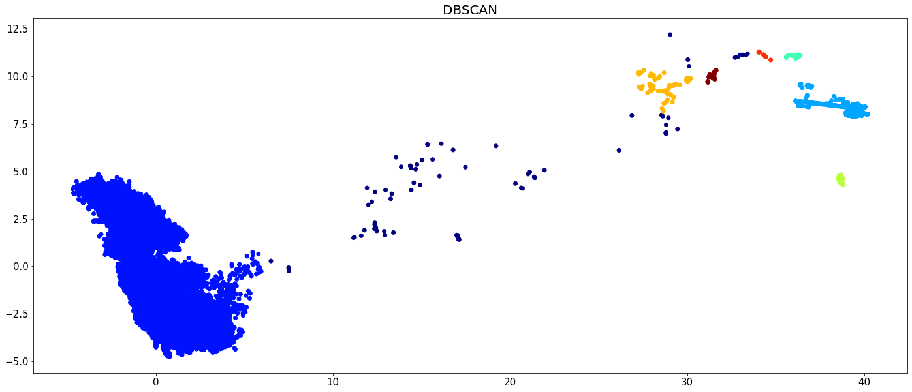
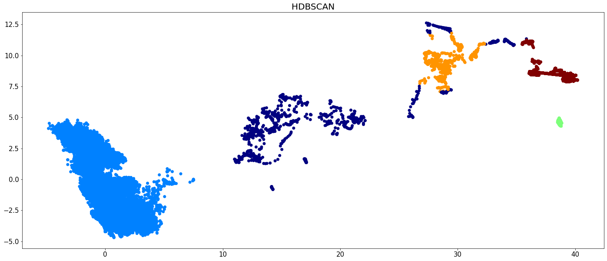
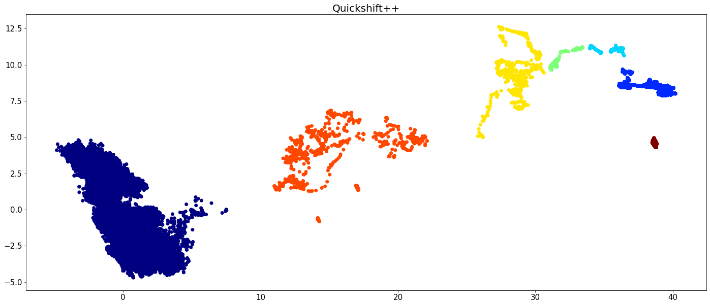
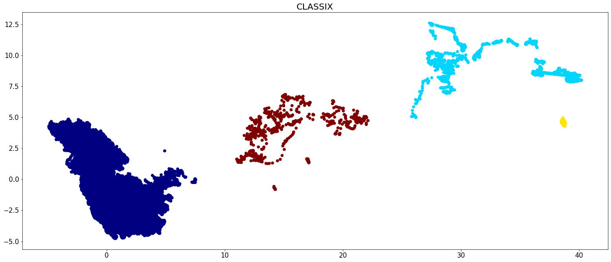
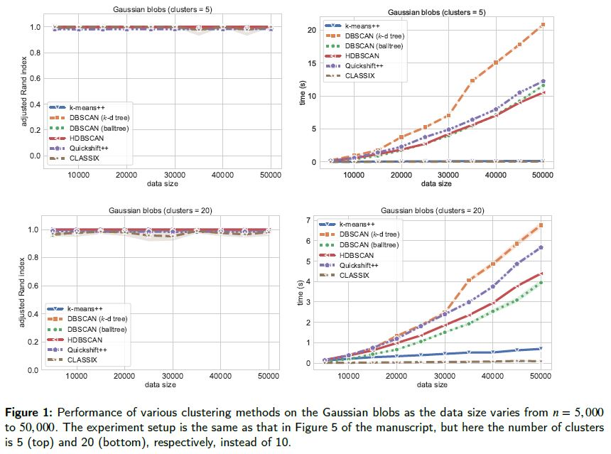

Performance Comparison
======================================

In this tutorial we compare CLASSIX with some widely used density-based clustering algorithms like DBSCAN, HDBSCAN and Quickshift++. We perform experiments on the VDU (Vacuum Distillation Unit) dataset that comes with the CLASSIX installation and with synthetically generated Gaussian blobs.

Example: VDU Data
##################


We first import the required modules and load the data:

.. code:: python

    import time
    import math
    import hdbscan
    import warnings
    import numpy as np
    import pandas as pd
    import seaborn as sns
    from sklearn import metrics
    from sklearn.cluster import DBSCAN
    import matplotlib.pyplot as plt
    from classix import CLASSIX, loadData
    from quickshift.QuickshiftPP import * # download from https://github.com/google/quickshift
    
    data = loadData('vdu_signals') # load the data
    print(data.shape) # (2028780, 2)

The data set has more than 2 million data points. Despite being only two-dimensional, this is challenging for many clustering algorithms as we will see. The timings reported below were obtained in this computational environment:

    * Dell PowerEdge R740 Server
    * 2x Intel Xeon Silver 4114 2.2G (total 20 cores, 40 threads)
    * 2x NVIDIA Tesla P100 16GB GPU
    * 1.5 TB RAM (=1536 GB RAM)
    * 1.8 TB disk space (expandable)

When run on the full data set, DBSCAN, HDBSCAN, Quickshift++ fail in this experiment (runtime > 24 hr) while CLASSIX requires around 1.5 seconds for the clustering of whole data. Therefore, to compare the four algorithms (and ensure they finish their computation within a day), we select 5% of the data for all competing algorithms except CLASSIX:

.. code:: python
    
    np.random.seed(0)
    sample = np.random.choice(data.shape[0], size=int(np.round(0.05*data.shape[0])))
    X = data[sample]
    print(X.shape)


We repeatedly run each algorithm 10 times and get the average runtime for comparison. All algorithms run on a single thread and the parameter settings for each algorithm are tuned for the best visual clustering result. 

.. code:: python
    
    sample_size = 10 # run each algorithm 10 times.
    timing = []
    
    sum_time = 0
    dbscan = DBSCAN(eps=0.6, min_samples=12)
    
    for i in range(sample_size):
        st = time.time()
        dbscan.fit(X)
        et = time.time()
        sum_time = sum_time + et - st
    
    timing.append(sum_time/sample_size)
    print("Average consume time: ", sum_time/sample_size)
    plt.figure(figsize=(24,10))
    plt.scatter(X[:,0], X[:,1], c=dbscan.labels_, cmap='jet')
    plt.tick_params(axis='both',  labelsize=15)
    plt.title('DBSCAN',  fontsize=20)
    plt.show()
    
    
    sum_time = 0
    _hdbscan = hdbscan.HDBSCAN(min_cluster_size=420, core_dist_n_jobs=1)
    
    for i in range(sample_size):
        st = time.time()    
        hdbscan_labels = _hdbscan.fit_predict(X)
        et = time.time()
        sum_time = sum_time + et - st
    
    timing.append(sum_time/sample_size)
    print("Average consume time: ", sum_time/sample_size)
    plt.figure(figsize=(24,10))
    plt.scatter(X[:,0], X[:,1], c=hdbscan_labels, cmap='jet')
    plt.tick_params(axis='both',  labelsize=15)
    plt.title('HDBSCAN',  fontsize=20)
    plt.show()
    
    sum_time = 0
    quicks = QuickshiftPP(k=450, beta=0.85)
    
    for i in range(sample_size):
        st = time.time()
        quicks.fit(X.copy(order='C'))
        quicks_labels = quicks.memberships
        et = time.time()
        sum_time = sum_time + et - st
    
    timing.append(sum_time/sample_size)
    print("Average consume time: ", sum_time/sample_size)
    plt.figure(figsize=(24,10))
    plt.scatter(X[:,0], X[:,1], c=quicks_labels, cmap='jet')
    plt.tick_params(axis='both',  labelsize=15)
    plt.title('Quickshift++',  fontsize=20)
    plt.show()
    
    sum_time = 0
    clx = CLASSIX(sorting='pca', radius=1, verbose=0, group_merging='distance')
    for i in range(sample_size):
        st = time.time()
        clx.fit_transform(data)
        et = time.time()
        sum_time = sum_time + et - st
    
    timing.append(sum_time/sample_size)
    print("Average consume time: ", sum_time/sample_size)
    plt.figure(figsize=(24,10))
    plt.scatter(data[:,0], data[:,1], c=clx.labels_, cmap='jet')
    plt.tick_params(axis='both',  labelsize=15)
    plt.title('CLASSIX',  fontsize=20)
    plt.show()
    
    sum_time = 0
    clx = CLASSIX(sorting='pca', radius=1, verbose=0, group_merging='distance', mergeTinyGroups=False)
    
    for i in range(sample_size):
        st = time.time()
        clx.fit_transform(data)
        et = time.time()
        sum_time = sum_time + et - st
    
    timing.append(sum_time/sample_size)
    print("Average consume time: ", sum_time/sample_size)
    plt.figure(figsize=(24,10))
    plt.scatter(data[:,0], data[:,1], c=clx.labels_, cmap='jet')
    plt.tick_params(axis='both',  labelsize=15)
    plt.title('CLASSIX - mergeTinyGroups',  fontsize=20)
    plt.show()
    





The runtime of all algorithms is visualized in the below bar chart. Recall that CLASSIX has been run on the full data set, while the other algorithms were run only on 5 percent of the data.

.. code:: python

    bardf = pd.DataFrame()
    names = ['DBSCAN \n(5%)', 'HDBSCAN \n(5%)', 'Quickshift++ \n(5%)', 'CLASSIX \n(100%)']
    bardf['clustering'] = names
    bardf['runtime'] = timing

    def colors_from_values(values, palettes):
        norm = (values - min(values)) / (max(values) - min(values))
        indices = np.round(norm * (len(values) - 1)).astype(np.int32)
        palettes = sns.color_palette(palettes, len(values))
        return np.array(palettes).take(indices, axis=0)


    pvals = np.array([0.1,0.2,0.4,0.6]) # np.array(timing)/np.sum(timing)
    plt.figure(figsize=(14, 9))
    sns.set(font_scale=1.5, style="whitegrid")
    ax = sns.barplot(x="clustering", y="runtime", data=bardf, width=0.6, 
                     palette=colors_from_values(pvals, 'Set1'))

    ax.bar_label(ax.containers[0], fmt='%.2f s')
    ax.set(xlabel=None)
    ax.set_ylabel("runtime", fontsize=28)
    plt.tick_params(axis='both', labelsize=19)
    plt.show()

.. image:: images/runtime.png


Example: Gaussian blobs
##################

We perform clustering algorithms on the Gaussian blob data, and provide three experimental examples with minor modifications that satisfies various parameter settings. 

2.1 Original paper experiment
~~~~~~~~~~~~~~~~~~~~~~
We now compare the algorithms on synthetic Gaussian blobs with increasing number of data points and dimension. Further details on this experiment can be found in the CLASSIX paper (https://arxiv.org/abs/2202.01456).  

.. code:: python

    # The test is referenced from https://hdbscan.readthedocs.io/en/latest/performance_and_scalability.html

    import time
    import hdbscan
    import warnings
    import sklearn.cluster
    import scipy.cluster
    import sklearn.datasets
    import numpy as np
    import pandas as pd
    import seaborn as sns
    from numpy.linalg import norm
    from classix.aggregation_test import aggregate
    from classix import CLASSIX
    from quickshift.QuickshiftPP import *
    from sklearn import metrics
    import matplotlib.pyplot as plt
    from threadpoolctl import threadpool_limits
    np.random.seed(0)


    def benchmark_algorithm_tdim(dataset_dimensions, cluster_function, function_args, function_kwds,
                            dataset_size=10000, dataset_n_clusters=10, max_time=45, sample_size=10, algorithm=None):

        result_time = np.nan * np.ones((len(dataset_dimensions), sample_size))
        result_ar = np.nan * np.ones((len(dataset_dimensions), sample_size))
        result_ami = np.nan * np.ones((len(dataset_dimensions), sample_size))

        for index, dimension in enumerate(dataset_dimensions):
            for s in range(sample_size):
                data, labels = sklearn.datasets.make_blobs(n_samples=dataset_size,
                                                           n_features=dimension,
                                                           centers=dataset_n_clusters, 
                                                           cluster_std=1) 

                # Start the clustering with a timer
                start_time = time.time()
                cluster_function.fit(data, *function_args, **function_kwds)
                time_taken = time.time() - start_time
                if algorithm == "Quickshift++":
                    preds = cluster_function.memberships
                else:
                    preds = cluster_function.labels_
                # print("labels num:", len(np.unique(preds))) 
                ar = metrics.adjusted_rand_score(labels, preds)
                ami = metrics.adjusted_mutual_info_score(labels, preds)
                # If we are taking more than max_time then abort -- we don't
                # want to spend excessive time on slow algorithms
                if time_taken > max_time: # Luckily, it won't happens in our experiment.
                    result_time[index, s] = time_taken
                    result_ar[index, s] = ar
                    result_ami[index, s] = ami
                    return pd.DataFrame(np.vstack([dataset_dimensions.repeat(sample_size), result_time.flatten()]).T, columns=['x','y']), \
                           pd.DataFrame(np.vstack([dataset_dimensions.repeat(sample_size), result_ar.flatten()]).T, columns=['x','y']), \
                           pd.DataFrame(np.vstack([dataset_dimensions.repeat(sample_size), result_ami.flatten()]).T, columns=['x','y'])
                else:
                    result_time[index, s] = time_taken
                    result_ar[index, s] = ar
                    result_ami[index, s] = ami

        # Return the result as a dataframe for easier handling with seaborn afterwards
        return pd.DataFrame(np.vstack([dataset_dimensions.repeat(sample_size), result_time.flatten()]).T, columns=['x','y']), \
               pd.DataFrame(np.vstack([dataset_dimensions.repeat(sample_size), result_ar.flatten()]).T, columns=['x','y']), \
               pd.DataFrame(np.vstack([dataset_dimensions.repeat(sample_size), result_ami.flatten()]).T, columns=['x','y'])


    def benchmark_algorithm_tsize(dataset_sizes, cluster_function, function_args, function_kwds,
                            dataset_dimension=10, dataset_n_clusters=10, max_time=45, sample_size=10, algorithm=None):

        result_time = np.nan * np.ones((len(dataset_sizes), sample_size))
        result_ar = np.nan * np.ones((len(dataset_sizes), sample_size))
        result_ami = np.nan * np.ones((len(dataset_sizes), sample_size))

        for index, size in enumerate(dataset_sizes):
            for s in range(sample_size):
                data, labels = sklearn.datasets.make_blobs(n_samples=size,
                                                           n_features=dataset_dimension,
                                                           centers=dataset_n_clusters, 
                                                           cluster_std=1) 

                # Start the clustering with a timer
                start_time = time.time()
                cluster_function.fit(data, *function_args, **function_kwds)
                time_taken = time.time() - start_time
                if algorithm == "Quickshift++":
                    preds = cluster_function.memberships
                else:
                    preds = cluster_function.labels_
                # print("labels num:", len(np.unique(preds))) 
                ar = metrics.adjusted_rand_score(labels, preds)
                ami = metrics.adjusted_mutual_info_score(labels, preds)
                # If we are taking more than max_time then abort -- we don't
                # want to spend excessive time on slow algorithms
                if time_taken > max_time: # Luckily, it won't happens in our experiment.
                    result_time[index, s] = time_taken
                    result_ar[index, s] = ar
                    result_ami[index, s] = ami
                    return pd.DataFrame(np.vstack([dataset_sizes.repeat(sample_size), result_time.flatten()]).T, columns=['x','y']), \
                           pd.DataFrame(np.vstack([dataset_sizes.repeat(sample_size), result_ar.flatten()]).T, columns=['x','y']), \
                           pd.DataFrame(np.vstack([dataset_sizes.repeat(sample_size), result_ami.flatten()]).T, columns=['x','y'])
                else:
                    result_time[index, s] = time_taken
                    result_ar[index, s] = ar
                    result_ami[index, s] = ami

        # Return the result as a dataframe for easier handling with seaborn afterwards
        return pd.DataFrame(np.vstack([dataset_sizes.repeat(sample_size), result_time.flatten()]).T, columns=['x','y']), \
               pd.DataFrame(np.vstack([dataset_sizes.repeat(sample_size), result_ar.flatten()]).T, columns=['x','y']), \
               pd.DataFrame(np.vstack([dataset_sizes.repeat(sample_size), result_ami.flatten()]).T, columns=['x','y'])


    def rn_gaussian_dim():
        warnings.filterwarnings("ignore")
        sns.set_context('poster')
        sns.set_palette('Paired', 10)
        sns.set_color_codes()
        dataset_dimensions = np.hstack([np.arange(1, 11) * 10])

        np.random.seed(0)
        with threadpool_limits(limits=1, user_api='blas'):
            k_means = sklearn.cluster.KMeans(n_clusters=10, init='k-means++')
            k_means_time, k_means_ar, k_means_ami = benchmark_algorithm_tdim(dataset_dimensions, k_means, (), {})

            dbscan = sklearn.cluster.DBSCAN(eps=10, min_samples=1, n_jobs=1, algorithm='ball_tree')
            dbscan_btree_time, dbscan_btree_ar, dbscan_btree_ami = benchmark_algorithm_tdim(dataset_dimensions, dbscan, (), {})

            dbscan = sklearn.cluster.DBSCAN(eps=10, min_samples=1, n_jobs=1, algorithm='kd_tree')
            dbscan_kdtree_time, dbscan_kdtree_ar, dbscan_kdtree_ami = benchmark_algorithm_tdim(dataset_dimensions, dbscan, (), {})

            hdbscan_ = hdbscan.HDBSCAN(algorithm='best', core_dist_n_jobs=1)
            hdbscan_time, hdbscan_ar, hdbscan_ami = benchmark_algorithm_tdim(dataset_dimensions, hdbscan_, (), {})

            classix = CLASSIX(sorting='pca', radius=0.3, minPts=5, group_merging='distance', verbose=0) 
            classix_time, classix_ar, classix_ami = benchmark_algorithm_tdim(dataset_dimensions, classix, (), {})

            quicks = QuickshiftPP(k=20, beta=0.7)
            quicks_time, quicks_ar, quicks_ami = benchmark_algorithm_tdim(dataset_dimensions, quicks, (), {}, algorithm='Quickshift++')

        k_means_time.to_csv("gd_kmeans_time.csv",index=False)
        dbscan_kdtree_time.to_csv("gd_dbscan_kdtree_time.csv",index=False)
        dbscan_btree_time.to_csv("gd_dbscan_btree_time.csv",index=False)
        hdbscan_time.to_csv("gd_hdbscan_time.csv",index=False)
        classix_time.to_csv("gd_classix_time.csv",index=False)
        quicks_time.to_csv("gd_quicks_time.csv",index=False)

        k_means_ar.to_csv("gd_kmeans_ar.csv",index=False)
        dbscan_kdtree_ar.to_csv("gd_dbscan_kdtree_ar.csv",index=False)
        dbscan_btree_ar.to_csv("gd_dbscan_btree_ar.csv",index=False)
        hdbscan_ar.to_csv("gd_hdbscan_ar.csv",index=False)
        classix_ar.to_csv("gd_classix_ar.csv",index=False)
        quicks_ar.to_csv("gd_quicks_ar.csv",index=False)


    def rn_gaussian_size():
        warnings.filterwarnings("ignore")
        sns.set_context('poster')
        sns.set_palette('Paired', 10)
        sns.set_color_codes()
        np.random.seed(0)
        dataset_sizes = np.hstack([np.arange(1, 11) * 5000])

        np.random.seed(0)
        with threadpool_limits(limits=1, user_api='blas'):
            k_means = sklearn.cluster.KMeans(n_clusters=10, init='k-means++')
            k_means_time, k_means_ar, k_means_ami = benchmark_algorithm_tsize(dataset_sizes, k_means, (), {})

            dbscan = sklearn.cluster.DBSCAN(eps=3, min_samples=1, n_jobs=1, algorithm='ball_tree')
            dbscan_btree_time, dbscan_btree_ar, dbscan_btree_ami = benchmark_algorithm_tsize(dataset_sizes, dbscan, (), {})

            dbscan = sklearn.cluster.DBSCAN(eps=3, min_samples=1, n_jobs=1, algorithm='kd_tree')
            dbscan_kdtree_time, dbscan_kdtree_ar, dbscan_kdtree_ami = benchmark_algorithm_tsize(dataset_sizes, dbscan, (), {})

            hdbscan_ = hdbscan.HDBSCAN(algorithm='best', core_dist_n_jobs=1)
            hdbscan_time, hdbscan_ar, hdbscan_ami = benchmark_algorithm_tsize(dataset_sizes, hdbscan_, (), {})

            classix = CLASSIX(sorting='pca', radius=0.3, minPts=5, group_merging='distance', verbose=0) 
            classix_time, classix_ar, classix_ami = benchmark_algorithm_tsize(dataset_sizes, classix, (), {})

            quicks = QuickshiftPP(k=20, beta=0.7)
            quicks_time, quicks_ar, quicks_ami = benchmark_algorithm_tsize(dataset_sizes, quicks, (), {}, algorithm='Quickshift++')


        k_means_time.to_csv("gs_kmeans_time.csv",index=False)
        dbscan_kdtree_time.to_csv("gs_dbscan_kdtree_time.csv",index=False)
        dbscan_btree_time.to_csv("gs_dbscan_btree_time.csv",index=False)
        hdbscan_time.to_csv("gs_hdbscan_time.csv",index=False)
        classix_time.to_csv("gs_classix_time.csv",index=False)
        quicks_time.to_csv("gs_quicks_time.csv",index=False)

        k_means_ar.to_csv("gs_kmeans_ar.csv",index=False)
        dbscan_kdtree_ar.to_csv("gs_dbscan_kdtree_ar.csv",index=False)
        dbscan_btree_ar.to_csv("gs_dbscan_btree_ar.csv",index=False)
        hdbscan_ar.to_csv("gs_hdbscan_ar.csv",index=False)
        classix_ar.to_csv("gs_classix_ar.csv",index=False)
        quicks_ar.to_csv("gs_quicks_ar.csv",index=False)


    def run_gassian_plot():
        # -------------------------------dim
        k_means_time = pd.read_csv("gd_kmeans_time.csv")
        dbscan_kdtree_time = pd.read_csv("gd_dbscan_kdtree_time.csv")
        dbscan_btree_time = pd.read_csv("gd_dbscan_btree_time.csv")
        hdbscan_time = pd.read_csv("gd_hdbscan_time.csv")
        classix_time = pd.read_csv("gd_classix_time.csv")
        quicks_time = pd.read_csv("gd_quicks_time.csv")

        k_means_ar = pd.read_csv("gd_kmeans_ar.csv")
        dbscan_kdtree_ar = pd.read_csv("gd_dbscan_kdtree_ar.csv")
        dbscan_btree_ar = pd.read_csv("gd_dbscan_btree_ar.csv")
        hdbscan_ar = pd.read_csv("gd_hdbscan_ar.csv")
        classix_ar = pd.read_csv("gd_classix_ar.csv")
        quicks_ar = pd.read_csv("gd_quicks_ar.csv")

        plt.figure(figsize=(12,8))
        plt.style.use('bmh')
        sns.set(font_scale=1.8)
        sns.set_style("whitegrid")
        plt.rcParams['axes.facecolor'] = 'white'
        # plt.rc('font', family='serif')

        ax = sns.lineplot(data=k_means_time, x="x", y="y", marker='v', markersize=13, label='k-means++', linestyle="-", linewidth=6)
        ax = sns.lineplot(data=dbscan_kdtree_time, x="x", y="y", marker='s', markersize=13, label='DBSCAN (kd-tree)', linestyle="--", linewidth=6)
        ax = sns.lineplot(data=dbscan_btree_time, x="x", y="y", marker='o', markersize=13, label='DBSCAN (ball tree)', linestyle=":", linewidth=6)
        ax = sns.lineplot(data=hdbscan_time, x="x", y="y", marker='<', markersize=13, label='HDBSCAN', linestyle="-", linewidth=6)
        ax = sns.lineplot(data=classix_time, x="x", y="y", marker='*', markersize=17, label='CLASSIX', linestyle="--", linewidth=6)
        ax = sns.lineplot(data=quicks_time, x="x", y="y", marker='p', markersize=17, label='Quickshift++', linestyle=(0, (3, 1, 1, 1, 1, 1)), linewidth=6)

        ax.set(xlabel='dimensions', ylabel='time (s)', title="Gaussian blobs (n=10000)")
        plt.tick_params(axis='both',  labelsize=22)

        plt.figure(figsize=(12,8))
        plt.style.use('bmh')
        sns.set(font_scale=1.8)
        sns.set_style("whitegrid")
        plt.rcParams['axes.facecolor'] = 'white'
        # plt.rc('font', family='serif')

        ax = sns.lineplot(data=k_means_ar, x="x", y="y", marker='v', markersize=13, label='k-means++', linestyle="-", linewidth=6)
        ax = sns.lineplot(data=dbscan_kdtree_ar, x="x", y="y", marker='s', markersize=13, label='DBSCAN (kd-tree)', linestyle="--", linewidth=6)
        ax = sns.lineplot(data=dbscan_btree_ar, x="x", y="y", marker='o', markersize=13, label='DBSCAN (ball tree)', linestyle=":", linewidth=6)
        ax = sns.lineplot(data=hdbscan_ar, x="x", y="y", marker='<', markersize=13, label='HDBSCAN', linestyle="-", linewidth=6)
        ax = sns.lineplot(data=classix_ar, x="x", y="y", marker='*', markersize=17, label='CLASSIX', linestyle="--", linewidth=6)
        ax = sns.lineplot(data=quicks_ar, x="x", y="y", marker='p', markersize=17, label='Quickshift++', linestyle=(0, (3, 1, 1, 1, 1, 1)), linewidth=6)

        ax.set(xlabel='dimensions', ylabel='adjusted Rand index', title="Gaussian blobs (n=10000)")
        ax.set(ylim=(-.1, 1.1))
        plt.tick_params(axis='both',  labelsize=22)

        # -------------------------------size
        k_means_time = pd.read_csv("gs_kmeans_time.csv")
        dbscan_kdtree_time = pd.read_csv("gs_dbscan_kdtree_time.csv")
        dbscan_btree_time = pd.read_csv("gs_dbscan_btree_time.csv")
        hdbscan_time = pd.read_csv("gs_hdbscan_time.csv")
        classix_time = pd.read_csv("gs_classix_time.csv")
        quicks_time = pd.read_csv("gs_quicks_time.csv")

        k_means_ar = pd.read_csv("gs_kmeans_ar.csv")
        dbscan_kdtree_ar = pd.read_csv("gs_dbscan_kdtree_ar.csv")
        dbscan_btree_ar = pd.read_csv("gs_dbscan_btree_ar.csv")
        hdbscan_ar = pd.read_csv("gs_hdbscan_ar.csv")
        classix_ar = pd.read_csv("gs_classix_ar.csv")
        quicks_ar = pd.read_csv("gs_quicks_ar.csv")

        plt.figure(figsize=(12,8))
        plt.style.use('bmh')
        sns.set(font_scale=1.8)
        sns.set_style("whitegrid")
        plt.rcParams['axes.facecolor'] = 'white'

        ax = sns.lineplot(data=k_means_time, x="x", y="y", marker='v', markersize=13, label='k-means++', linestyle="-", linewidth=6)
        ax = sns.lineplot(data=dbscan_kdtree_time, x="x", y="y", marker='s', markersize=13, label='DBSCAN (kd-tree)', linestyle="--", linewidth=6)
        ax = sns.lineplot(data=dbscan_btree_time, x="x", y="y", marker='o', markersize=13, label='DBSCAN (ball tree)', linestyle=":", linewidth=6)
        ax = sns.lineplot(data=hdbscan_time, x="x", y="y", marker='<', markersize=13, label='HDBSCAN', linestyle="-", linewidth=6)
        ax = sns.lineplot(data=classix_time, x="x", y="y", marker='*', markersize=17, label='CLASSIX', linestyle="--", linewidth=6)
        ax = sns.lineplot(data=quicks_time, x="x", y="y", marker='p', markersize=17, label='Quickshift++', linestyle=(0, (3, 1, 1, 1, 1, 1)), linewidth=6)

        ax.set(xlabel='data size', ylabel='time (s)', title="Gaussian blobs (dim=10)")
        plt.tick_params(axis='both',  labelsize=22)

        plt.figure(figsize=(12,8))
        plt.style.use('bmh')
        sns.set(font_scale=1.8)
        sns.set_style("whitegrid")
        plt.rcParams['axes.facecolor'] = 'white'

        ax = sns.lineplot(data=k_means_ar, x="x", y="y", marker='v', markersize=13, label='k-means++', linestyle="-", linewidth=6)
        ax = sns.lineplot(data=dbscan_kdtree_ar, x="x", y="y", marker='s', markersize=13, label='DBSCAN (kd-tree)', linestyle="--", linewidth=6)
        ax = sns.lineplot(data=dbscan_btree_ar, x="x", y="y", marker='o', markersize=13, label='DBSCAN (ball tree)', linestyle=":", linewidth=6)
        ax = sns.lineplot(data=hdbscan_ar, x="x", y="y", marker='<', markersize=13, label='HDBSCAN', linestyle="-", linewidth=6)
        ax = sns.lineplot(data=classix_ar, x="x", y="y", marker='*', markersize=17, label='CLASSIX', linestyle="--", linewidth=6)
        ax = sns.lineplot(data=quicks_ar, x="x", y="y", marker='p', markersize=17, label='Quickshift++', linestyle=(0, (3, 1, 1, 1, 1, 1)), linewidth=6)

        ax.set(xlabel='data size', ylabel='adjusted Rand index', title="Gaussian blobs (dim=10)")
        ax.set(ylim=(0, 1.1))
        plt.tick_params(axis='both',  labelsize=22)

    
    if __name__ == '__main__':
        rn_gaussian_dim()
        rn_gaussian_size()
        run_gassian_plot()

    
.. image:: images/performance1.png 
    
    
    
    
    
2.2 Varying cluster sizes of 5 and 20
~~~~~~~~~~~~~~~~~~~~~~

We show how to run test for cluster size of 5 and 20 with increasing data size, which aims to evalute the clustering algorithmic performance with varying clusters as well as data sizes. For test code, we refer to `classix/exp/revision/size_revision1.ipynb <https://github.com/nla-group/classix/blob/master/exp/revision/size_revision1.ipynb>`_ and `classix/exp/revision/size_revision2.ipynb <https://github.com/nla-group/classix/blob/master/exp/revision/size_revision2.ipynb>`_ for the code scripts and associated results.

.. code:: python

    import time
    import hdbscan
    import warnings
    import sklearn.cluster
    import scipy.cluster
    import sklearn.datasets
    import numpy as np
    import pandas as pd
    import seaborn as sns
    from numpy.linalg import norm
    from classix.aggregation_test import aggregate
    from classix import CLASSIX
    from quickshift.QuickshiftPP import *
    from sklearn import metrics
    import matplotlib.pyplot as plt
    from threadpoolctl import threadpool_limits
    np.random.seed(0)

    def benchmark_algorithm_tsize(dataset_sizes, cluster_function, function_args, function_kwds,
                            dataset_dimension=10, dataset_n_clusters=5, max_time=45, sample_size=10, algorithm=None):

        # Initialize the result with NaNs so that any unfilled entries
        # will be considered NULL when we convert to a pandas dataframe at the end
        result_time = np.nan * np.ones((len(dataset_sizes), sample_size))
        result_ar = np.nan * np.ones((len(dataset_sizes), sample_size))
        result_ami = np.nan * np.ones((len(dataset_sizes), sample_size))

        for index, size in enumerate(dataset_sizes):
            for s in range(sample_size):
                # Use sklearns make_blobs to generate a random dataset with specified size
                # dimension and number of clusters
                # set cluster_std=0.1 to ensure clustering rely less on tuning parameters.
                data, labels = sklearn.datasets.make_blobs(n_samples=size,
                                                           n_features=dataset_dimension,
                                                           centers=dataset_n_clusters, 
                                                           cluster_std=1) 

                # Start the clustering with a timer
                start_time = time.time()
                cluster_function.fit(data, *function_args, **function_kwds)
                time_taken = time.time() - start_time
                if algorithm == "Quickshift++":
                    preds = cluster_function.memberships
                else:
                    preds = cluster_function.labels_
                # print("labels num:", len(np.unique(preds))) 
                ar = metrics.adjusted_rand_score(labels, preds)
                ami = metrics.adjusted_mutual_info_score(labels, preds)
                # If we are taking more than max_time then abort -- we don't
                # want to spend excessive time on slow algorithms
                if time_taken > max_time: # Luckily, it won't happens in our experiment.
                    result_time[index, s] = time_taken
                    result_ar[index, s] = ar
                    result_ami[index, s] = ami
                    return pd.DataFrame(np.vstack([dataset_sizes.repeat(sample_size), result_time.flatten()]).T, columns=['x','y']), \
                           pd.DataFrame(np.vstack([dataset_sizes.repeat(sample_size), result_ar.flatten()]).T, columns=['x','y']), \
                           pd.DataFrame(np.vstack([dataset_sizes.repeat(sample_size), result_ami.flatten()]).T, columns=['x','y'])
                else:
                    result_time[index, s] = time_taken
                    result_ar[index, s] = ar
                    result_ami[index, s] = ami

        # Return the result as a dataframe for easier handling with seaborn afterwards
        return pd.DataFrame(np.vstack([dataset_sizes.repeat(sample_size), result_time.flatten()]).T, columns=['x','y']), \
               pd.DataFrame(np.vstack([dataset_sizes.repeat(sample_size), result_ar.flatten()]).T, columns=['x','y']), \
               pd.DataFrame(np.vstack([dataset_sizes.repeat(sample_size), result_ami.flatten()]).T, columns=['x','y'])


    def rn_gaussian_size(dataset_n_clusters=5):
        warnings.filterwarnings("ignore")
        sns.set_context('poster')
        sns.set_palette('Paired', 10)
        sns.set_color_codes()
        np.random.seed(0)
        dataset_sizes = np.hstack([np.arange(1, 11) * 5000])

        np.random.seed(0)
        with threadpool_limits(limits=1, user_api='blas'):
            k_means = sklearn.cluster.KMeans(n_clusters=5, init='k-means++')
            k_means_time, k_means_ar, k_means_ami = benchmark_algorithm_tsize(dataset_sizes, k_means, (), {}, 
                                                                              dataset_n_clusters=dataset_n_clusters)

            dbscan = sklearn.cluster.DBSCAN(eps=3, min_samples=1, n_jobs=1, algorithm='ball_tree')
            dbscan_btree_time, dbscan_btree_ar, dbscan_btree_ami = benchmark_algorithm_tsize(dataset_sizes, dbscan, (), {},
                                                                              dataset_n_clusters=dataset_n_clusters)

            dbscan = sklearn.cluster.DBSCAN(eps=3, min_samples=1, n_jobs=1, algorithm='kd_tree')
            dbscan_kdtree_time, dbscan_kdtree_ar, dbscan_kdtree_ami = benchmark_algorithm_tsize(dataset_sizes, dbscan, (), {},
                                                                              dataset_n_clusters=dataset_n_clusters)

            hdbscan_ = hdbscan.HDBSCAN(algorithm='best', core_dist_n_jobs=1)
            hdbscan_time, hdbscan_ar, hdbscan_ami = benchmark_algorithm_tsize(dataset_sizes, hdbscan_, (), {}, 
                                                                              dataset_n_clusters=dataset_n_clusters)

            classix = CLASSIX(sorting='pca', radius=0.3, minPts=5, group_merging='distance', verbose=0) 
            classix_time, classix_ar, classix_ami = benchmark_algorithm_tsize(dataset_sizes, classix, (), {}, 
                                                                              dataset_n_clusters=dataset_n_clusters)

            quicks = QuickshiftPP(k=20, beta=0.7)
            quicks_time, quicks_ar, quicks_ami = benchmark_algorithm_tsize(dataset_sizes, quicks, (), {}, 
                                                            dataset_n_clusters=dataset_n_clusters, algorithm='Quickshift++')


        return k_means_time, dbscan_kdtree_time, dbscan_btree_time, hdbscan_time, classix_time, quicks_time, k_means_ar, dbscan_kdtree_ar, dbscan_btree_ar, hdbscan_ar, classix_ar, quicks_ar
        
        

    def run_gassian_plot():
        # -------------------------------dim
        k_means_time = pd.read_csv("gs_kmeans_time1.csv")
        dbscan_kdtree_time = pd.read_csv("gs_dbscan_kdtree_time1.csv")
        dbscan_btree_time = pd.read_csv("gs_dbscan_btree_time1.csv")
        hdbscan_time = pd.read_csv("gs_hdbscan_time1.csv")
        classix_time = pd.read_csv("gs_classix_time1.csv")
        quicks_time = pd.read_csv("gs_quicks_time1.csv")

        k_means_ar = pd.read_csv("gs_kmeans_ar1.csv")
        dbscan_kdtree_ar = pd.read_csv("gs_dbscan_kdtree_ar1.csv")
        dbscan_btree_ar = pd.read_csv("gs_dbscan_btree_ar1.csv")
        hdbscan_ar = pd.read_csv("gs_hdbscan_ar1.csv")
        classix_ar = pd.read_csv("gs_classix_ar1.csv")
        quicks_ar = pd.read_csv("gs_quicks_ar1.csv")

        plt.figure(figsize=(12,8))
        plt.style.use('bmh')
        sns.set(font_scale=1.8)
        sns.set_style("whitegrid")
        plt.rcParams['axes.facecolor'] = 'white'
        # plt.rc('font', family='serif')

        ax = sns.lineplot(data=k_means_time, x="x", y="y", marker='v', markersize=13, label='k-means++', linestyle="-", linewidth=6)
        ax = sns.lineplot(data=dbscan_kdtree_time, x="x", y="y", marker='s', markersize=13, label='DBSCAN ($k$-d tree)', linestyle="--", linewidth=6)
        ax = sns.lineplot(data=dbscan_btree_time, x="x", y="y", marker='o', markersize=13, label='DBSCAN (balltree)', linestyle=":", linewidth=6)
        ax = sns.lineplot(data=hdbscan_time, x="x", y="y", marker='<', markersize=13, label='HDBSCAN', linestyle="-", linewidth=6)
        ax = sns.lineplot(data=quicks_time, x="x", y="y", marker='p', markersize=17, label='Quickshift++', linestyle=(0, (3, 1, 1, 1, 1, 1)), linewidth=6)
        ax = sns.lineplot(data=classix_time, x="x", y="y", marker='*', markersize=17, label='CLASSIX', linestyle="--", linewidth=6)

        ax.set(xlabel='data size', ylabel='time (s)', title="Gaussian blobs (clusters = 5)")
        plt.tick_params(axis='both',  labelsize=22)

        plt.figure(figsize=(12,8))
        plt.style.use('bmh')
        sns.set(font_scale=1.8)
        sns.set_style("whitegrid")
        plt.rcParams['axes.facecolor'] = 'white'
        # plt.rc('font', family='serif')

        ax = sns.lineplot(data=k_means_ar, x="x", y="y", marker='v', markersize=13, label='k-means++', linestyle="-", linewidth=6)
        ax = sns.lineplot(data=dbscan_kdtree_ar, x="x", y="y", marker='s', markersize=13, label='DBSCAN ($k$-d tree)', linestyle="--", linewidth=6)
        ax = sns.lineplot(data=dbscan_btree_ar, x="x", y="y", marker='o', markersize=13, label='DBSCAN (balltree)', linestyle=":", linewidth=6)
        ax = sns.lineplot(data=hdbscan_ar, x="x", y="y", marker='<', markersize=13, label='HDBSCAN', linestyle="-", linewidth=6)
        ax = sns.lineplot(data=quicks_ar, x="x", y="y", marker='p', markersize=17, label='Quickshift++', linestyle=(0, (3, 1, 1, 1, 1, 1)), linewidth=6)
        ax = sns.lineplot(data=classix_ar, x="x", y="y", marker='*', markersize=17, label='CLASSIX', linestyle="--", linewidth=6)

        ax.set(xlabel='data size', ylabel='adjusted Rand index', title="Gaussian blobs (clusters = 5)")
        ax.set(ylim=(-.1, 1.1))
        plt.tick_params(axis='both',  labelsize=22)

        # -------------------------------size
        k_means_time = pd.read_csv("gs_kmeans_time2.csv")
        dbscan_kdtree_time = pd.read_csv("gs_dbscan_kdtree_time2.csv")
        dbscan_btree_time = pd.read_csv("gs_dbscan_btree_time2.csv")
        hdbscan_time = pd.read_csv("gs_hdbscan_time2.csv")
        classix_time = pd.read_csv("gs_classix_time2.csv")
        quicks_time = pd.read_csv("gs_quicks_time2.csv")

        k_means_ar = pd.read_csv("gs_kmeans_ar2.csv")
        dbscan_kdtree_ar = pd.read_csv("gs_dbscan_kdtree_ar2.csv")
        dbscan_btree_ar = pd.read_csv("gs_dbscan_btree_ar2.csv")
        hdbscan_ar = pd.read_csv("gs_hdbscan_ar2.csv")
        classix_ar = pd.read_csv("gs_classix_ar2.csv")
        quicks_ar = pd.read_csv("gs_quicks_ar2.csv")

        plt.figure(figsize=(12,8))
        plt.style.use('bmh')
        sns.set(font_scale=1.8)
        sns.set_style("whitegrid")
        plt.rcParams['axes.facecolor'] = 'white'

        ax = sns.lineplot(data=k_means_time, x="x", y="y", marker='v', markersize=13, label='k-means++', linestyle="-", linewidth=6)
        ax = sns.lineplot(data=dbscan_kdtree_time, x="x", y="y", marker='s', markersize=13, label='DBSCAN ($k$-d tree)', linestyle="--", linewidth=6)
        ax = sns.lineplot(data=dbscan_btree_time, x="x", y="y", marker='o', markersize=13, label='DBSCAN (balltree)', linestyle=":", linewidth=6)
        ax = sns.lineplot(data=hdbscan_time, x="x", y="y", marker='<', markersize=13, label='HDBSCAN', linestyle="-", linewidth=6)
        ax = sns.lineplot(data=quicks_time, x="x", y="y", marker='p', markersize=17, label='Quickshift++', linestyle=(0, (3, 1, 1, 1, 1, 1)), linewidth=6)
        ax = sns.lineplot(data=classix_time, x="x", y="y", marker='*', markersize=17, label='CLASSIX', linestyle="--", linewidth=6)

        ax.set(xlabel='data size', ylabel='time (s)', title="Gaussian blobs (clusters = 20)")
        plt.tick_params(axis='both',  labelsize=22)

        plt.figure(figsize=(12,8))
        plt.style.use('bmh')
        sns.set(font_scale=1.8)
        sns.set_style("whitegrid")
        plt.rcParams['axes.facecolor'] = 'white'

        ax = sns.lineplot(data=k_means_ar, x="x", y="y", marker='v', markersize=13, label='k-means++', linestyle="-", linewidth=6)
        ax = sns.lineplot(data=dbscan_kdtree_ar, x="x", y="y", marker='s', markersize=13, label='DBSCAN ($k$-d tree)', linestyle="--", linewidth=6)
        ax = sns.lineplot(data=dbscan_btree_ar, x="x", y="y", marker='o', markersize=13, label='DBSCAN (balltree)', linestyle=":", linewidth=6)
        ax = sns.lineplot(data=hdbscan_ar, x="x", y="y", marker='<', markersize=13, label='HDBSCAN', linestyle="-", linewidth=6)
        ax = sns.lineplot(data=quicks_ar, x="x", y="y", marker='p', markersize=17, label='Quickshift++', linestyle=(0, (3, 1, 1, 1, 1, 1)), linewidth=6)
        ax = sns.lineplot(data=classix_ar, x="x", y="y", marker='*', markersize=17, label='CLASSIX', linestyle="--", linewidth=6)

        ax.set(xlabel='data size', ylabel='adjusted Rand index', title="Gaussian blobs (clusters = 20)")
        ax.set(ylim=(0, 1.1))
        plt.tick_params(axis='both',  labelsize=22)
        
        
    if __name__ == '__main__':
        result1  = rn_gaussian_size(dataset_n_clusters=5)
        k_means_time1, dbscan_kdtree_time1, dbscan_btree_time1, hdbscan_time1, classix_time1, quicks_time1, k_means_ar1, dbscan_kdtree_ar1, dbscan_btree_ar1, hdbscan_ar1, classix_ar1, quicks_ar1 = result1

        k_means_time1.to_csv("gs_kmeans_time1.csv",index=False)
        dbscan_kdtree_time1.to_csv("gs_dbscan_kdtree_time1.csv",index=False)
        dbscan_btree_time1.to_csv("gs_dbscan_btree_time1.csv",index=False)
        hdbscan_time1.to_csv("gs_hdbscan_time1.csv",index=False)
        classix_time1.to_csv("gs_classix_time1.csv",index=False)
        quicks_time1.to_csv("gs_quicks_time1.csv",index=False)

        k_means_ar1.to_csv("gs_kmeans_ar1.csv",index=False)
        dbscan_kdtree_ar1.to_csv("gs_dbscan_kdtree_ar1.csv",index=False)
        dbscan_btree_ar1.to_csv("gs_dbscan_btree_ar1.csv",index=False)
        hdbscan_ar1.to_csv("gs_hdbscan_ar1.csv",index=False)
        classix_ar1.to_csv("gs_classix_ar1.csv",index=False)
        quicks_ar1.to_csv("gs_quicks_ar1.csv",index=False)
        
        result2 = rn_gaussian_size(dataset_n_clusters=20)
        k_means_time2, dbscan_kdtree_time2, dbscan_btree_time2, hdbscan_time2, classix_time2, quicks_time2, k_means_ar2, dbscan_kdtree_ar2, dbscan_btree_ar2, hdbscan_ar2, classix_ar2, quicks_ar2 = result2
        
        k_means_time2.to_csv("gs_kmeans_time2.csv",index=False)
        dbscan_kdtree_time2.to_csv("gs_dbscan_kdtree_time2.csv",index=False)
        dbscan_btree_time2.to_csv("gs_dbscan_btree_time2.csv",index=False)
        hdbscan_time2.to_csv("gs_hdbscan_time2.csv",index=False)
        classix_time2.to_csv("gs_classix_time2.csv",index=False)
        quicks_time2.to_csv("gs_quicks_time2.csv",index=False)

        k_means_ar2.to_csv("gs_kmeans_ar2.csv",index=False)
        dbscan_kdtree_ar2.to_csv("gs_dbscan_kdtree_ar2.csv",index=False)
        dbscan_btree_ar2.to_csv("gs_dbscan_btree_ar2.csv",index=False)
        hdbscan_ar2.to_csv("gs_hdbscan_ar2.csv",index=False)
        classix_ar2.to_csv("gs_classix_ar2.csv",index=False)
        quicks_ar2.to_csv("gs_quicks_ar2.csv",index=False)

        
        run_gassian_plot()
    
   
 The performance is illustrated in the following figure. 
    

    
    
    
    
    
    
    
    
    
    
    
    
    
    
    
    
    
    
2.3 Additional test script
~~~~~~~~~~~~~~~~~~~~~~

This test shows the averaging result with varying cluster size, researchers of interest can copy the following code and change the corresponding paramters, e.g., the ```dataset_n_clusters```.

.. code:: python

    import time
    import hdbscan
    import warnings
    import sklearn.cluster
    import scipy.cluster
    import sklearn.datasets
    import numpy as np
    import pandas as pd
    import seaborn as sns
    from numpy.linalg import norm
    from classix.aggregation_test import aggregate
    from classix import CLASSIX
    from quickshift.QuickshiftPP import *
    from sklearn import metrics
    import matplotlib.pyplot as plt
    from threadpoolctl import threadpool_limits
    np.random.seed(0)


    def benchmark_algorithm_tdim(dataset_dimensions, 
                             cluster_function='k-means++', 
                             dataset_size=10000, 
                             sample_size=10):

        result_time = np.zeros((len(dataset_dimensions), sample_size))
        result_ar = np.zeros((len(dataset_dimensions), sample_size))
        result_ami = np.zeros((len(dataset_dimensions), sample_size))

        dataset_n_clusters = [5, 20]
        for index, dimension in enumerate(dataset_dimensions):
            for s in range(sample_size):
                for n_cluster in dataset_n_clusters:
                    data, labels = sklearn.datasets.make_blobs(n_samples=dataset_size,
                                                               n_features=dimension,
                                                               centers=n_cluster, 
                                                               cluster_std=1) 

                    if cluster_function == 'k-means++':
                        start_time = time.time()
                        k_means = sklearn.cluster.KMeans(n_clusters=n_cluster, init='k-means++')
                        k_means.fit(data)
                        time_taken = time.time() - start_time
                        preds = k_means.labels_

                    elif cluster_function == 'DBSCAN (kd-tree)':
                        start_time = time.time()
                        dbscan = sklearn.cluster.DBSCAN(eps=10, min_samples=1, n_jobs=1, algorithm='kd_tree')
                        dbscan.fit(data)
                        time_taken = time.time() - start_time
                        preds = dbscan.labels_

                    elif cluster_function == 'DBSCAN (ball-tree)':
                        start_time = time.time()
                        dbscan = sklearn.cluster.DBSCAN(eps=10, min_samples=1, n_jobs=1, algorithm='ball_tree')
                        dbscan.fit(data)
                        time_taken = time.time() - start_time
                        preds =dbscan.labels_

                    elif cluster_function == 'HDBSCAN':
                        start_time = time.time()
                        hdbscan_ = hdbscan.HDBSCAN(algorithm='best', core_dist_n_jobs=1)
                        hdbscan_.fit(data)
                        time_taken = time.time() - start_time
                        preds = hdbscan_.labels_

                    elif cluster_function == "Quickshift++":
                        start_time = time.time()
                        quicks = QuickshiftPP(k=20, beta=0.7)
                        quicks.fit(data)
                        time_taken = time.time() - start_time
                        preds = quicks.memberships

                    else:
                        start_time = time.time()
                        classix = CLASSIX(sorting='pca', radius=0.3, minPts=5, group_merging='distance', verbose=0) 
                        classix.fit(data)
                        time_taken = time.time() - start_time
                        preds = classix.labels_


                    ar = metrics.adjusted_rand_score(labels, preds)
                    ami = metrics.adjusted_mutual_info_score(labels, preds)

                    result_time[index, s] += time_taken / len(dataset_n_clusters)
                    result_ar[index, s] += ar / len(dataset_n_clusters)
                    result_ami[index, s] += ami / len(dataset_n_clusters)

        return pd.DataFrame(np.vstack([dataset_dimensions.repeat(sample_size), result_time.flatten()]).T, columns=['x','y']), \
               pd.DataFrame(np.vstack([dataset_dimensions.repeat(sample_size), result_ar.flatten()]).T, columns=['x','y']), \
               pd.DataFrame(np.vstack([dataset_dimensions.repeat(sample_size), result_ami.flatten()]).T, columns=['x','y'])


    def benchmark_algorithm_tsize(dataset_sizes, cluster_function, function_args, function_kwds,
                            dataset_dimension=10, dataset_n_clusters=10, max_time=45, sample_size=10, algorithm=None):

        result_time = np.nan * np.ones((len(dataset_sizes), sample_size))
        result_ar = np.nan * np.ones((len(dataset_sizes), sample_size))
        result_ami = np.nan * np.ones((len(dataset_sizes), sample_size))

        for index, size in enumerate(dataset_sizes):
            for s in range(sample_size):
                data, labels = sklearn.datasets.make_blobs(n_samples=size,
                                                           n_features=dataset_dimension,
                                                           centers=dataset_n_clusters, 
                                                           cluster_std=1) 

                start_time = time.time()
                cluster_function.fit(data, *function_args, **function_kwds)
                time_taken = time.time() - start_time
                if algorithm == "Quickshift++":
                    preds = cluster_function.memberships
                else:
                    preds = cluster_function.labels_ 
                ar = metrics.adjusted_rand_score(labels, preds)
                ami = metrics.adjusted_mutual_info_score(labels, preds)
                if time_taken > max_time: # Luckily, it won't happens in our experiment.
                    result_time[index, s] = time_taken
                    result_ar[index, s] = ar
                    result_ami[index, s] = ami
                    return pd.DataFrame(np.vstack([dataset_sizes.repeat(sample_size), result_time.flatten()]).T, columns=['x','y']), \
                           pd.DataFrame(np.vstack([dataset_sizes.repeat(sample_size), result_ar.flatten()]).T, columns=['x','y']), \
                           pd.DataFrame(np.vstack([dataset_sizes.repeat(sample_size), result_ami.flatten()]).T, columns=['x','y'])
                else:
                    result_time[index, s] = time_taken
                    result_ar[index, s] = ar
                    result_ami[index, s] = ami

        return pd.DataFrame(np.vstack([dataset_sizes.repeat(sample_size), result_time.flatten()]).T, columns=['x','y']), \
               pd.DataFrame(np.vstack([dataset_sizes.repeat(sample_size), result_ar.flatten()]).T, columns=['x','y']), \
               pd.DataFrame(np.vstack([dataset_sizes.repeat(sample_size), result_ami.flatten()]).T, columns=['x','y'])


    def rn_gaussian_dim():
        warnings.filterwarnings("ignore")
        sns.set_context('poster')
        sns.set_palette('Paired', 10)
        sns.set_color_codes()
        dataset_dimensions = np.hstack([np.arange(1, 11) * 10])

        np.random.seed(0)

        with threadpool_limits(limits=1, user_api='blas'):
            k_means_time, k_means_ar, k_means_ami = benchmark_algorithm_tdim(dataset_dimensions, cluster_function='k-means++')
            dbscan_kdtree_time, dbscan_kdtree_ar, dbscan_kdtree_ami = benchmark_algorithm_tdim(dataset_dimensions, cluster_function='DBSCAN (kd-tree)')
            dbscan_btree_time, dbscan_btree_ar, dbscan_btree_ami = benchmark_algorithm_tdim(dataset_dimensions, cluster_function='DBSCAN (ball-tree)')
            hdbscan_time, hdbscan_ar, hdbscan_ami = benchmark_algorithm_tdim(dataset_dimensions, cluster_function='HDBSCAN')
            quicks_time, quicks_ar, quicks_ami = benchmark_algorithm_tdim(dataset_dimensions, cluster_function='Quickshift++')
            classix_time, classix_ar, classix_ami = benchmark_algorithm_tdim(dataset_dimensions, cluster_function='CLASSIX')


        k_means_time.to_csv("gd_kmeans_time.csv",index=False)
        dbscan_kdtree_time.to_csv("gd_dbscan_kdtree_time.csv",index=False)
        dbscan_btree_time.to_csv("gd_dbscan_btree_time.csv",index=False)
        hdbscan_time.to_csv("gd_hdbscan_time.csv",index=False)
        classix_time.to_csv("gd_classix_time.csv",index=False)
        quicks_time.to_csv("gd_quicks_time.csv",index=False)

        k_means_ar.to_csv("gd_kmeans_ar.csv",index=False)
        dbscan_kdtree_ar.to_csv("gd_dbscan_kdtree_ar.csv",index=False)
        dbscan_btree_ar.to_csv("gd_dbscan_btree_ar.csv",index=False)
        hdbscan_ar.to_csv("gd_hdbscan_ar.csv",index=False)
        classix_ar.to_csv("gd_classix_ar.csv",index=False)
        quicks_ar.to_csv("gd_quicks_ar.csv",index=False)


    def rn_gaussian_size():
        warnings.filterwarnings("ignore")
        sns.set_context('poster')
        sns.set_palette('Paired', 10)
        sns.set_color_codes()
        np.random.seed(0)
        dataset_sizes = np.hstack([np.arange(1, 11) * 5000])

        np.random.seed(0)
        with threadpool_limits(limits=1, user_api='blas'):
            k_means = sklearn.cluster.KMeans(n_clusters=10, init='k-means++')
            k_means_time, k_means_ar, k_means_ami = benchmark_algorithm_tsize(dataset_sizes, k_means, (), {})

            dbscan = sklearn.cluster.DBSCAN(eps=3, min_samples=1, n_jobs=1, algorithm='ball_tree')
            dbscan_btree_time, dbscan_btree_ar, dbscan_btree_ami = benchmark_algorithm_tsize(dataset_sizes, dbscan, (), {})

            dbscan = sklearn.cluster.DBSCAN(eps=3, min_samples=1, n_jobs=1, algorithm='kd_tree')
            dbscan_kdtree_time, dbscan_kdtree_ar, dbscan_kdtree_ami = benchmark_algorithm_tsize(dataset_sizes, dbscan, (), {})

            hdbscan_ = hdbscan.HDBSCAN(algorithm='best', core_dist_n_jobs=1)
            hdbscan_time, hdbscan_ar, hdbscan_ami = benchmark_algorithm_tsize(dataset_sizes, hdbscan_, (), {})

            classix = CLASSIX(sorting='pca', radius=0.3, minPts=5, group_merging='distance', verbose=0) 
            classix_time, classix_ar, classix_ami = benchmark_algorithm_tsize(dataset_sizes, classix, (), {})

            quicks = QuickshiftPP(k=20, beta=0.7)
            quicks_time, quicks_ar, quicks_ami = benchmark_algorithm_tsize(dataset_sizes, quicks, (), {}, algorithm='Quickshift++')


        k_means_time.to_csv("gs_kmeans_time.csv",index=False)
        dbscan_kdtree_time.to_csv("gs_dbscan_kdtree_time.csv",index=False)
        dbscan_btree_time.to_csv("gs_dbscan_btree_time.csv",index=False)
        hdbscan_time.to_csv("gs_hdbscan_time.csv",index=False)
        classix_time.to_csv("gs_classix_time.csv",index=False)
        quicks_time.to_csv("gs_quicks_time.csv",index=False)

        k_means_ar.to_csv("gs_kmeans_ar.csv",index=False)
        dbscan_kdtree_ar.to_csv("gs_dbscan_kdtree_ar.csv",index=False)
        dbscan_btree_ar.to_csv("gs_dbscan_btree_ar.csv",index=False)
        hdbscan_ar.to_csv("gs_hdbscan_ar.csv",index=False)
        classix_ar.to_csv("gs_classix_ar.csv",index=False)
        quicks_ar.to_csv("gs_quicks_ar.csv",index=False)


    def run_gassian_plot():
        # -------------------------------dim
        k_means_time = pd.read_csv("results/exp1/gd_kmeans_time.csv")
        dbscan_kdtree_time = pd.read_csv("results/exp1/gd_dbscan_kdtree_time.csv")
        dbscan_btree_time = pd.read_csv("results/exp1/gd_dbscan_btree_time.csv")
        hdbscan_time = pd.read_csv("results/exp1/gd_hdbscan_time.csv")
        classix_time = pd.read_csv("results/exp1/gd_classix_time.csv")
        quicks_time = pd.read_csv("results/exp1/gd_quicks_time.csv")

        k_means_ar = pd.read_csv("results/exp1/gd_kmeans_ar.csv")
        dbscan_kdtree_ar = pd.read_csv("results/exp1/gd_dbscan_kdtree_ar.csv")
        dbscan_btree_ar = pd.read_csv("results/exp1/gd_dbscan_btree_ar.csv")
        hdbscan_ar = pd.read_csv("results/exp1/gd_hdbscan_ar.csv")
        classix_ar = pd.read_csv("results/exp1/gd_classix_ar.csv")
        quicks_ar = pd.read_csv("results/exp1/gd_quicks_ar.csv")

        plt.figure(figsize=(12,8))
        plt.style.use('bmh')
        sns.set(font_scale=1.8)
        sns.set_style("whitegrid")
        plt.rcParams['axes.facecolor'] = 'white'
        # plt.rc('font', family='serif')

        ax = sns.lineplot(data=k_means_time, x="x", y="y", color='c', marker='v', markersize=13, label='k-means++', linestyle="-", linewidth=6)
        ax = sns.lineplot(data=dbscan_kdtree_time, x="x", y="y", color='tomato', marker='s', markersize=13, label='DBSCAN ($k$-d tree)', linestyle="--", linewidth=6)
        ax = sns.lineplot(data=dbscan_btree_time, x="x", y="y", color='yellowgreen', marker='o', markersize=13, label='DBSCAN (ball tree)', linestyle=":", linewidth=6)
        ax = sns.lineplot(data=hdbscan_time, x="x", y="y", color='m', marker='<', markersize=13, label='HDBSCAN', linestyle="-", linewidth=6)
        ax = sns.lineplot(data=quicks_time, x="x", y="y", color='darkorange', marker='p', markersize=17, label='Quickshift++', linestyle=(0, (3, 1, 1, 1, 1, 1)), linewidth=6)
        ax = sns.lineplot(data=classix_time, x="x", y="y", color='olive', marker='*', markersize=17, label='CLASSIX', linestyle="--", linewidth=6)

        ax.set(xlabel='dimension', ylabel='time (s)', title="Gaussian blobs ($n$=10000)")
        plt.tick_params(axis='both',  labelsize=22)

        plt.figure(figsize=(12,8))
        plt.style.use('bmh')
        sns.set(font_scale=1.8)
        sns.set_style("whitegrid")
        plt.rcParams['axes.facecolor'] = 'white'
        # plt.rc('font', family='serif')

        ax = sns.lineplot(data=k_means_ar, x="x", y="y", color='c', marker='v', markersize=13, label='k-means++', linestyle="-", linewidth=6)
        ax = sns.lineplot(data=dbscan_kdtree_ar, x="x", y="y", color='tomato', marker='s', markersize=13, label='DBSCAN ($k$-d tree)', linestyle="--", linewidth=6)
        ax = sns.lineplot(data=dbscan_btree_ar, x="x", y="y", color='yellowgreen', marker='o', markersize=13, label='DBSCAN (ball tree)', linestyle=":", linewidth=6)
        ax = sns.lineplot(data=hdbscan_ar, x="x", y="y", color='m', marker='<', markersize=13, label='HDBSCAN', linestyle="-", linewidth=6)
        ax = sns.lineplot(data=quicks_ar, x="x", y="y", color='darkorange', marker='p', markersize=17, label='Quickshift++', linestyle=(0, (3, 1, 1, 1, 1, 1)), linewidth=6)
        ax = sns.lineplot(data=classix_ar, x="x", y="y", color='olive', marker='*', markersize=17, label='CLASSIX', linestyle="--", linewidth=6)

        ax.set(xlabel='dimension', ylabel='adjusted Rand index', title="Gaussian blobs ($n$=10000)")
        ax.set(ylim=(-.1, 1.1))
        plt.tick_params(axis='both',  labelsize=22)

        k_means_time = pd.read_csv("gs_kmeans_time.csv")
        dbscan_kdtree_time = pd.read_csv("gs_dbscan_kdtree_time.csv")
        dbscan_btree_time = pd.read_csv("gs_dbscan_btree_time.csv")
        hdbscan_time = pd.read_csv("gs_hdbscan_time.csv")
        classix_time = pd.read_csv("gs_classix_time.csv")
        quicks_time = pd.read_csv("gs_quicks_time.csv")

        k_means_ar = pd.read_csv("gs_kmeans_ar.csv")
        dbscan_kdtree_ar = pd.read_csv("gs_dbscan_kdtree_ar.csv")
        dbscan_btree_ar = pd.read_csv("gs_dbscan_btree_ar.csv")
        hdbscan_ar = pd.read_csv("gs_hdbscan_ar.csv")
        classix_ar = pd.read_csv("gs_classix_ar.csv")
        quicks_ar = pd.read_csv("gs_quicks_ar.csv")


        plt.figure(figsize=(12,8))
        plt.style.use('bmh')
        sns.set(font_scale=1.8)
        sns.set_style("whitegrid")
        plt.rcParams['axes.facecolor'] = 'white'

        ax = sns.lineplot(data=k_means_time, x="x", y="y", color='c', marker='v', markersize=13, label='k-means++', linestyle="-", linewidth=6)
        ax = sns.lineplot(data=dbscan_kdtree_time, x="x", y="y", color='tomato', marker='s', markersize=13, label='DBSCAN ($k$-d tree)', linestyle="--", linewidth=6)
        ax = sns.lineplot(data=dbscan_btree_time, x="x", y="y", color='yellowgreen', marker='o', markersize=13, label='DBSCAN (ball tree)', linestyle=":", linewidth=6)
        ax = sns.lineplot(data=hdbscan_time, x="x", y="y", color='m', marker='<', markersize=13, label='HDBSCAN', linestyle="-", linewidth=6)
        ax = sns.lineplot(data=quicks_time, x="x", y="y", color='darkorange', marker='p', markersize=17, label='Quickshift++', linestyle=(0, (3, 1, 1, 1, 1, 1)), linewidth=6)
        ax = sns.lineplot(data=classix_time, x="x", y="y", color='olive', marker='*', markersize=17, label='CLASSIX', linestyle="--", linewidth=6)

        ax.set(xlabel='data size', ylabel='time (s)', title="Gaussian blobs ($d$=10)")
        plt.tick_params(axis='both',  labelsize=22)

        plt.figure(figsize=(12,8))
        plt.style.use('bmh')
        sns.set(font_scale=1.8)
        sns.set_style("whitegrid")
        plt.rcParams['axes.facecolor'] = 'white'

        ax = sns.lineplot(data=k_means_ar, x="x", y="y", color='c', marker='v', markersize=13, label='k-means++', linestyle="-", linewidth=6)
        ax = sns.lineplot(data=dbscan_kdtree_ar, x="x", y="y", color='tomato', marker='s', markersize=13, label='DBSCAN ($k$-d tree)', linestyle="--", linewidth=6)
        ax = sns.lineplot(data=dbscan_btree_ar, x="x", y="y", color='yellowgreen', marker='o', markersize=13, label='DBSCAN (ball tree)', linestyle=":", linewidth=6)
        ax = sns.lineplot(data=hdbscan_ar, x="x", y="y", color='m', marker='<', markersize=13, label='HDBSCAN', linestyle="-", linewidth=6)
        ax = sns.lineplot(data=quicks_ar, x="x", y="y", color='darkorange', marker='p', markersize=17, label='Quickshift++', linestyle=(0, (3, 1, 1, 1, 1, 1)), linewidth=6)
        ax = sns.lineplot(data=classix_ar, x="x", y="y", color='olive', marker='*', markersize=17, label='CLASSIX', linestyle="--", linewidth=6)

        ax.set(xlabel='data size', ylabel='adjusted Rand index', title="Gaussian blobs ($d$=10)")
        ax.set(ylim=(0, 1.1))
        plt.tick_params(axis='both',  labelsize=22)
    
    
    if __name__ == '__main__':
        rn_gaussian_dim()
        rn_gaussian_size()
        run_gassian_plot()

    
.. image:: images/performance.png
